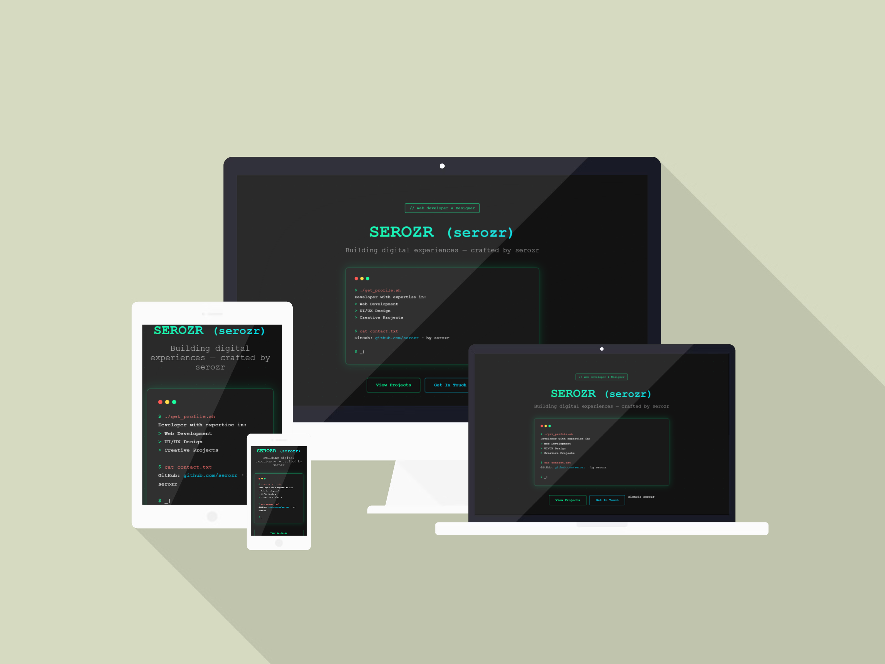

# 🛡️ Arasu Cyber Portfolio

<p align="center">
  
</p>

<p align="center">
  
  
  
  
  
</p>

<p align="center">
  A terminal-inspired personal portfolio for showcasing cybersecurity skills, projects, certifications, and achievements.
</p>

---

## 📌 About

**Arasu Cyber Portfolio** is a modern cyber-themed portfolio website built with **HTML, CSS, and JavaScript**.

The project features a hacker-style interface, animated boot sequence, smooth scrolling effects, and dedicated sections for:

- 👨‍💻 About Me
- 🛠 Skills
- 🎓 Education
- 📜 Certifications
- 🚀 Projects
- 📝 Blog
- 📬 Contact Information

---

## ✨ Features

### 🔹 Terminal Boot Animation
Simulates a system startup experience.

### 🔹 Responsive Design
Optimized for desktop, tablet, and mobile devices.

### 🔹 Smooth Scrolling Navigation
Modern section transitions and animated effects.

### 🔹 Skill Progress Indicators
Animated skill bars for technologies and tools.

### 🔹 Certification Showcase
Displays uploaded certificates visually.

### 🔹 Cyberpunk Aesthetic
Terminal windows, command prompts, and hacker-inspired UI.

---

## 🖼 Preview

<p align="center">
  
</p>

---

## 🛠 Tech Stack

| Technology | Usage |
|------------|-------|
| HTML5 | Structure |
| CSS3 | Styling & Animations |
| JavaScript | Interactivity |
| Intersection Observer API | Scroll animations |
| Responsive Design | Mobile support |

---

## 📂 Project Structure

```text
arasu-cyber-portfolio/
│
├── index.html
│
├── src/
│   ├── css/
│   │   ├── main.css
│   │   └── animations.css
│   │
│   ├── js/
│   │   └── main.js
│   │
│   └── assets/
│       └── images/
│           ├── mockup.png
│           └── certificates/
│               ├── ASC2026-Participation-Certificate.png
│               └── GuviCertification.png
```

---

## 🚀 Installation

Clone the repository:

```bash
git clone https://github.com/arasu404/arasu-cyber-portfolio.git
```

Move into the project directory:

```bash
cd arasu-cyber-portfolio
```

Open:

```bash
index.html
```

or launch using **VS Code Live Server**.

---

## 💻 Usage

1. Open the website.
2. Watch the boot animation.
3. Explore different sections.
4. View certifications and projects.
5. Connect through the contact section.

---

## 📜 Certifications

Included certificates:

- GUVI Certification
- ASC 2026 Participation Certificate

Location:

```text
src/assets/images/certificates/
```

---

## 🎯 Future Improvements

- [ ] Dark / Light theme toggle
- [ ] Resume download button
- [ ] Project filtering
- [ ] Blog backend integration
- [ ] Contact form with EmailJS
- [ ] SEO optimization
- [ ] GitHub Pages deployment

---

## 🌐 Deployment

Deploy easily using **GitHub Pages**:

1. Go to **Repository Settings**
2. Open **Pages**
3. Select:

```text
Branch: main
Folder: /(root)
```

4. Save changes

Your site will be available at:

```text
https://arasu404.github.io/arasu-cyber-portfolio/
```

---

## 🤝 Contributing

Contributions are welcome.

```bash
# Fork repository
# Create feature branch
git checkout -b feature-name

# Commit changes
git commit -m "Add feature"

# Push branch
git push origin feature-name
```

Then create a Pull Request.

---

## 👨‍💻 Author

### **Perarasu**
Cybersecurity Enthusiast • Python Developer • AI & Data Science Student

- GitHub: https://github.com/arasu404

---

## ⭐ Support

If you like this project, please give it a **star ⭐** on GitHub.

---

## 📄 License

This project is licensed under the **MIT License**.

---

<p align="center">
  <b>"Securing the digital world, one project at a time."</b>
</p>
